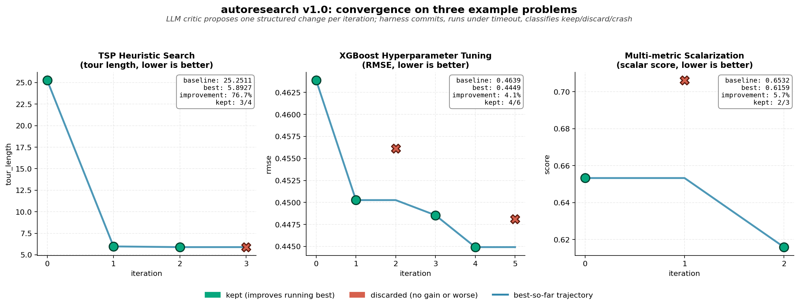

# autoresearch

[](https://doi.org/10.5281/zenodo.19772195)
[](https://opensource.org/licenses/MIT)

## Citation

If you use this software, please cite it as:

```bibtex
@software{brom_autoresearch_2026,
  title   = {autoresearch: Autonomous Research Loop with a Local LLM Critic (v1.0)},
  author  = {Brom, Pedro Carvalho},
  year    = {2026},
  doi     = {10.5281/zenodo.19772195},
  url     = {https://doi.org/10.5281/zenodo.19772195},
  license = {MIT}
}
```

The Concept DOI [`10.5281/zenodo.19772194`](https://doi.org/10.5281/zenodo.19772194)
always resolves to the latest version.

---

Autonomous research loop with a local LLM critic. Generalization of the
[karpathy/autoresearch](https://github.com/karpathy/autoresearch) pattern: any
problem with a single metric, a fixed time budget, a single mutable file and
git tracking can be optimized overnight by an LLM critic that proposes one
iterative change at a time.

The critic runs locally via [Ollama](https://ollama.com) (Gemma family by
default) and emits structured JSON (`thought_process`, alternatives,
`hypothesis`, `code_pseudocode`, `risk_level`). The agent harness (Claude,
Codex, or any tool with file-edit capabilities) reads the proposal, applies it
to the mutable file, and the loop runs the experiment, classifies it as
`keep` / `discard` / `crash`, and advances or resets the git branch.



*Convergence on the three shipped examples (TSP heuristic, XGBoost tuning, multi-metric scalarization). Green markers = kept proposals; red = discarded; blue line = best-so-far trajectory. Annotations report baseline, best, percent improvement and kept count. Data extracted directly from each `examples/*/sample_run/results.tsv`.*

## Why

The original `karpathy/autoresearch` is a great pattern but tied to a single
LLM-pretraining repository. This project extracts the pattern into a small
Python package usable for **any** optimization problem expressible as:

1. A **single metric** parsable from the runner's stdout.
2. A **fixed time budget** that makes runs comparable across platforms.
3. A **single mutable file** the agent edits.
4. **Read-only files** that define the contract (data, evaluation, constants).
5. A **git branch** dedicated to one research session.

Examples shipped: hyperparameter tuning of XGBoost (CPU), heuristic search for
TSP. Anything else that fits the contract works with a `problem.yaml` and a
`solution.py`.

## Install

```bash
pip install -e .
# or directly from the source tree:
pip install pyyaml openai

# Pull any Ollama-served model that honors JSON Schema responses; the choice
# is set via `gemma_critic.model` in problem.yaml. Examples:
ollama pull <model>          # e.g. gemma4:e2b, gemma3:12b, gemma3:27b, qwen2.5:7b
```

Optional but recommended for the runtime garbage collector:

```bash
pip install torch    # used only to free CUDA caches between iterations
```

## Quick start (TSP example)

```bash
TARGET=/tmp/tsp_run
EXAMPLE=$(python3 -c "import autoresearch, pathlib; print(pathlib.Path(autoresearch.__file__).parent.parent / 'examples/tsp_heuristic')")

# 1. Scaffold a project from the example's problem.yaml
autoresearch init --problem $EXAMPLE/problem.yaml --target $TARGET --tag run1
cp $EXAMPLE/{prepare,evaluate,solution}.py $TARGET/
cd $TARGET && git add -A && git commit -q -m "scaffold"

export AUTORESEARCH_PROJECT=$TARGET
export AUTORESEARCH_PROBLEM=$TARGET/problem.yaml

# 2. Wizard validates 9 preconditions stepwise
autoresearch wizard next   # repeat until 'all_done'
echo "$(date -Iseconds)" > $TARGET/.autoresearch/loop_confirmed
autoresearch wizard step confirm_loop

# 3. Run the loop
autoresearch loop
```

## Driving the loop with AI coding agents

The agent harness in [How it works](#how-it-works) is intentionally generic:
any tool that can edit files in the project directory and run shell commands
can drive the loop. This makes Claude Code, OpenAI Codex, and OpenCode
plug-and-play. Point any of them at this repository and they will install,
scaffold and iterate.

Three things the coding agent does per iteration:

1. `autoresearch run` (commits, executes, classifies)
2. `autoresearch critic` (writes `next_idea.json`)
3. Read `next_idea.json` and edit `solution.py`

`autoresearch loop` automates steps 1 and 2 and pauses at the `noop` state
until a new edit has been applied. The agent only needs to handle step 3.

### Claude Code

```bash
claude
> Install autoresearch from https://github.com/pcbrom/autoresearch and set up
  the TSP example. Then drive the loop, applying each next_idea.json suggestion
  to solution.py until I stop you.
```

### OpenAI Codex (CLI)

```bash
codex "clone https://github.com/pcbrom/autoresearch, install it, scaffold the
TSP example, and drive the autoresearch loop by editing solution.py with each
next_idea.json suggestion"
```

### OpenCode

```bash
opencode
> Read https://github.com/pcbrom/autoresearch/blob/master/README.md, set up
  the TSP example, and drive the autoresearch loop end-to-end.
```

All three follow the same pattern: install the package, scaffold a project
from one of the examples, validate the 9 wizard preconditions, then iterate by
editing `solution.py` based on `next_idea.json` written by the critic. No
manual CLI orchestration is required.

## How it works

```
                      ┌─── runs experiment ────┐
                      ▼                        │
agent edits solution.py       autoresearch run ────▶ results.tsv
        ▲                                      │
        │                                      ▼
        └── reads next_idea.json ◀──── autoresearch critic (Ollama)
```

Each iteration:

1. `autoresearch run` commits the current `solution.py`, runs the configured
   `runner` with `timeout hard_timeout_s`, extracts the metric via the
   configured regex, classifies the result against the running best, appends a
   row to `results.tsv`, and either advances the branch (`keep`) or runs
   `git reset --hard HEAD~1` (`discard`/`crash`).
2. `autoresearch critic` calls Ollama with a JSON-Schema constrained response.
   The schema includes explicit Chain-of-Thought slots
   (`thought_process`, `alternatives_considered`) so reasoning is captured
   even when Ollama does not expose native thinking.
3. The agent harness reads `next_idea.json`, applies the change to
   `solution.py` (file edit), and the next iteration begins.

`autoresearch loop` wires steps 1 and 2 together and waits 5–30s when no edit
has been made since the last commit (the `noop` state).

## Wizard

`autoresearch loop` refuses to start until the wizard validates 9 preconditions:

| # | Step | What it checks |
|---|------|----------------|
| 1 | `repo_git` | target is a git repo |
| 2 | `tools_present` | git, python3, ollama in PATH |
| 3 | `problem_yaml` | schema valid + paths resolve |
| 4 | `ollama_model` | configured model is pulled and Ollama responds |
| 5 | `vram_budget` | enough free VRAM (NVIDIA only; soft check) |
| 6 | `baseline_smoke` | runner executes once, regex matches, within timeout |
| 7 | `critic_dry_run` | Gemma returns valid JSON Schema |
| 8 | `cleanup_check` | no zombie ollama processes, log rotation in place |
| 9 | `confirm_loop` | explicit human gate file |

`autoresearch wizard status` shows current state, `autoresearch wizard next`
runs the next pending step, `autoresearch wizard reset` clears state.

## Audit log

`autoresearch audit` consolidates everything into a navigable timeline:

- summary (baseline, best, total improvement, keep rate)
- wizard preconditions table
- per-iteration entries with the linked critic reasoning
  (`thought_process`, `alternatives_considered`, `hypothesis`, `expected_delta`,
  `justification`, `code_pseudocode`, `risk_level`, plus thinking blocks if any)
- top hits ranked by delta vs previous keep
- crash stack traces (tail of the per-commit `run.log`)

Outputs `AUDIT_LOG.md` (human) and `AUDIT_LOG.json` (machine).

Per-call critic logs are persisted to
`<project>/.autoresearch/critic_logs/<ts>_<commit>.jsonl` with the full prompt,
raw response, parsed JSON, and any thinking/reasoning fields the model emitted.

## State snapshot

`autoresearch state` regenerates `STATE.md` — a compact navigable snapshot
(running best, next idea, last 10 experiments, recent crashes, git log).
Throttled by mtime (default 300s) so heavy loops do not thrash it.

## Garbage collection

Every iteration:

- `ollama stop <model>` if `gemma_critic.when: downtime`
- rotates `run.log` into `.autoresearch/logs/run-<commit>.log` (keeps last 20)
- `gc.collect()` + `torch.cuda.empty_cache()` + `torch.cuda.ipc_collect()` (if torch present)

On `SIGINT/SIGTERM`: same cleanup + removes the loop pidfile (`trap EXIT`-style).

## Critic configuration

**Default**: local Ollama running **Gemma 3n e2b** (~7 GB VRAM). All examples
ship with this configuration. The choice is intentional: e2b is small enough
to coexist with most runners on a 12 GB+ GPU and produces structured JSON
reliably with explicit Chain-of-Thought.

```yaml
gemma_critic:
  enabled: true
  model: gemma4:e2b           # default — change to any Ollama-served model
  when: always                 # always (coexists) | downtime (free VRAM between runs)
  thinking: true               # CoT-enriched prompt + best-effort thinking flag
  max_vram_gb: 8
  context_last_n: 10
  ollama_url: http://localhost:11434/v1
```

### Swapping the critic

The critic is **OpenAI API-compatible** (`openai` SDK + `base_url` + `api_key`),
so any backend that speaks that protocol works without code changes — only
adjust the YAML:

| Backend | `model` | `ollama_url` (rename of `base_url`) | Notes |
|---------|---------|--------------------------------------|-------|
| Ollama (default)      | `gemma4:e2b`, `gemma3:12b`, `gemma3:27b`, `qwen2.5:7b`, ... | `http://localhost:11434/v1` | Pull with `ollama pull <model>` |
| vLLM serve            | `google/gemma-3-27b-it`, etc.                                | `http://localhost:8000/v1`   | `--reasoning-parser gemma3` exposes `message.reasoning` |
| OpenAI API            | `gpt-4o-mini`, `gpt-5`, ...                                  | `https://api.openai.com/v1`  | Set `OPENAI_API_KEY` env var (override `api_key="ollama"` in `critic.py`) |
| Anthropic via proxy   | `claude-opus-4-7` (via `litellm` / `openrouter`)             | `http://localhost:<proxy>/v1`| Any OpenAI-compat proxy |
| Local llama.cpp       | served model name                                            | `http://localhost:8080/v1`   | `llama-server --api-key ...` |

For non-OpenAI-compatible backends (raw Anthropic SDK, Vertex, Bedrock), edit
[`autoresearch/critic.py`](autoresearch/critic.py) — replace the
`OpenAI(...).chat.completions.create(...)` call with the target SDK. The
JSON-Schema response (`NEXT_IDEA_SCHEMA`) is the only contract the rest of the
loop depends on.

`when: always` keeps the critic loaded (cheaper latency). `when: downtime`
calls `ollama stop` after each critic call to free VRAM before the next runner
starts — useful with larger models (~17 GB MoE) on a 24 GB GPU.

## Examples

- [`examples/tsp_heuristic`](examples/tsp_heuristic/) — 50-city Euclidean TSP, no GPU needed
- [`examples/xgboost_tuning`](examples/xgboost_tuning/) — California Housing regression, CPU only
- [`examples/multi_metric_demo`](examples/multi_metric_demo/) — three metrics
  (rmse + latency + size) collapsed via convex sum; demonstrates the
  multi-metric pattern. See [`docs/multi-metric.md`](docs/multi-metric.md) for
  the four scalarizers and when to pick each.

All three examples ship a `sample_run/` with a real execution: `AUDIT_LOG.md`
with the linked Gemma critic reasoning per iteration, `results.tsv`,
`STATE.md`, and the per-call critic JSONL logs.

## Adapting to your problem

1. Write a `problem.yaml` (see [templates/problem.yaml.template](templates/problem.yaml.template)).
2. Provide `solution.py` (mutable) and any read-only files (`prepare.py`,
   `evaluate.py`, etc.) the runner needs.
3. The runner must print the metric on a line matching `metric_regex`.
4. Run `autoresearch init` and follow the wizard.

That is the whole contract.

## License

MIT License. See [LICENSE](LICENSE).
